# Flux CD: Kubernetes The GitOps way
Kubernetes is wonderful technology and even though we can declaratively define our deployment in there. It is still pain to manually manage them. Flux CD With its flexible architecture and robust feature set enables teams to achieve a reliable and auditable deployment process while promoting collaboration and traceability across different environments. Now that’s a DevOps dream come true or maybe a half of it :). Even though it’s not a full CI/CD package, it is still nice Continuous Deployment tool.

_My lab for today is based on Kind. For some strange reason my lab on DigitalOcean was very finicky. I did need to install Docker and Kubectl on my Debian in order to install and use Kind._

### Pre-requisite:
- Github Account and knowledge of using it
- Kubernetes and git already installed

### Agenda:
- Install and configure Flux
- Deploying three set of Deployments using 3 different ways.
- Extending our deployment through Kustomization
  
#### Install;
I am using Debian (bullseye) so my method of installation will be different then others.
https://fluxcd.io/flux/installation/#install-the-flux-cli.

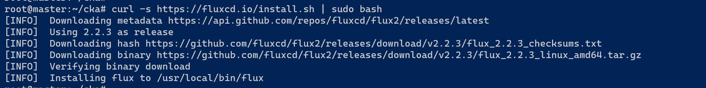
```
curl -s https://fluxcd.io/install.sh | sudo bash

flux – --version

flux check – --pre
```

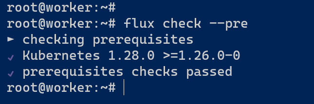

Configuring our environment variable for Github and flux to use.
```
export GITHUB_TOKEN=<your-token>
export GITHUB_USER=<your-username>
```
 

GitHub Bootstrap with Flux CLI

Directory to watch out for: In the following boot strap path section `--path=fruits/picker` we are telling Flux to watch out for this location basically. i do not need image-reflector-controller and image-automation-controller but i like to add that whenever i install Flux in my lab.
```
flux bootstrap github  --owner=$GITHUB_USER  --repository=garden --path=fruits/picker  --personal=true --private=false --components-extra=image-reflector-controller,image-automation-controller
```

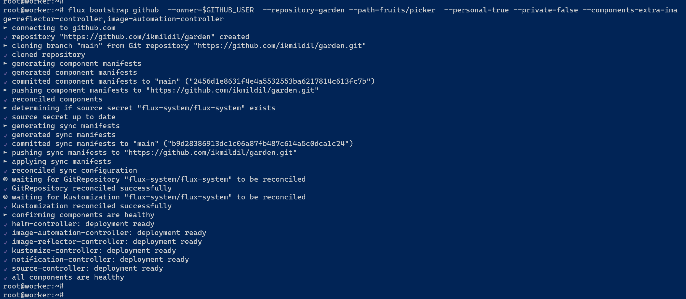

We are going to clone the repository that we have used in our bootstrapping process. Cd into it and use tree command to get the clear picture;
```
git clone https://github.com/$GITHUB_USER/garden
cd garden/
tree
```

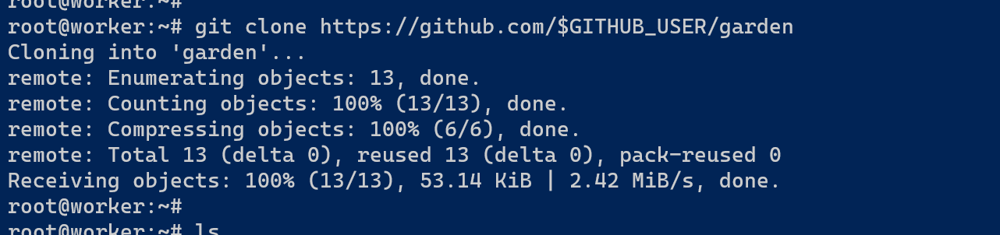  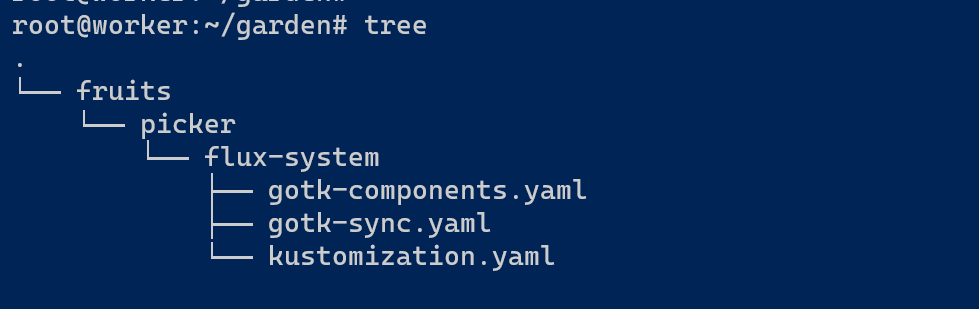

Now that installation and configuration is all done, it’s time to start deploying our apps and services.
Before deploying anything let’s have a look at my cluster.


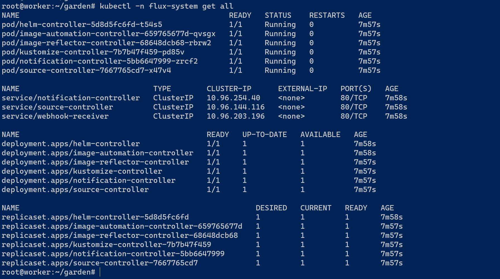

### Deployment method: 1
Now we are going to put one deployment file `web-nginx.yaml` in `fruits/picker` for flux to pickup but we are going to make seperate directory `web-nginx` for it like so;
```
fruits/picker/web-nginx/web-nginx.yaml
```
```
apiVersion: apps/v1
kind: Deployment
metadata:
  creationTimestamp: null
  labels:
    app: web-dub
  name: web-dub
  namespace: default
spec:
  replicas: 2
  selector:
    matchLabels:
      app: web-dub
  strategy: {}
  template:
    metadata:
      creationTimestamp: null
      labels:
        app: web-dub
    spec:
      containers:
      - image: nginx
        name: nginx
```


and similary for ‘web-nginx-svc.yaml’
```
fruits/picker/web-nginx/web-nginx-svc.yaml
```

```
apiVersion: v1
kind: Service
metadata:
  creationTimestamp: null
  labels:
    app: web-dub
  name: web-dub-svc
  namespace: default
spec:
  ports:
  - port: 80
    protocol: TCP
    targetPort: 80
    nodePort: 30011
  selector:
    app: web-dub
  type: NodePort
```
We will follow the git usual procedure to add, commit and push. Little after we do that  we should see our deployment. The time it takes to show up depends upon the time set in `garden/fruits/picker/flux-system/gotk-sync.yaml`. As the time interval in `gotk-sync.yaml`  is set to  `interval: 1m0s` , we should see our deployment and services up and running in one minute.

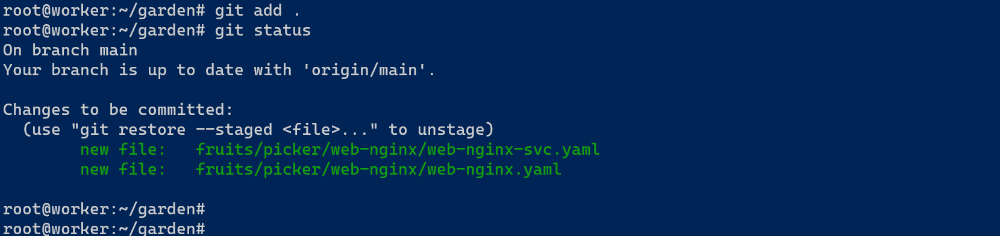   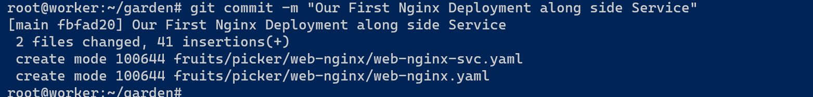

We should see our deployment called  `web-dub` and services `web-dub-svc` along side replicasets.

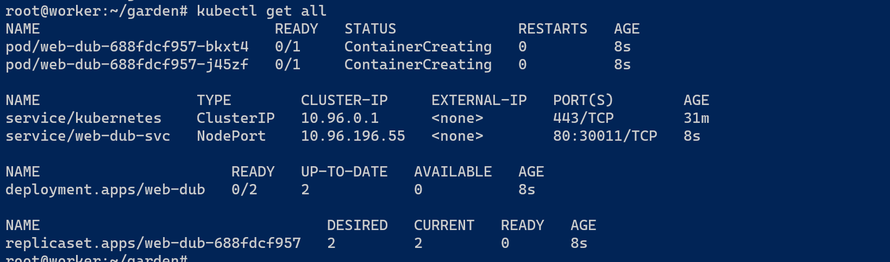

### Deployment method: 2
I am going to add another deployment and service by uploading their yaml files online using Github website this time. Their yaml files are;

```
stranger-web.yaml
```

```
apiVersion: apps/v1
kind: Deployment
metadata:
  creationTimestamp: null
  labels:
    app: stranger-web
  name: stranger-web
  namespace: default
spec:
  replicas: 2
  selector:
    matchLabels:
      app: stranger-web
  strategy: {}
  template:
    metadata:
      creationTimestamp: null
      labels:
        app: stranger-web
    spec:
      containers:
      - image: nginx
        name: nginx
```

```
stranger-web-svc.yaml
```

```
apiVersion: v1
kind: Service
metadata:
  creationTimestamp: null
  labels:
    app: stranger-web
  name: stranger-web-svc
  namespace: default
spec:
  ports:
  - port: 80
    protocol: TCP
    targetPort: 80
    nodePort: 30022
  selector:
    app: stranger-web
  type: NodePort
```


As we can see `picker/web-nginx/` has four yamls files in total now. 


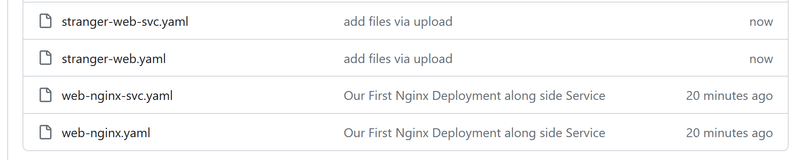


After a minute if we execute `kubectl` we should see another bunch of deployments and service.


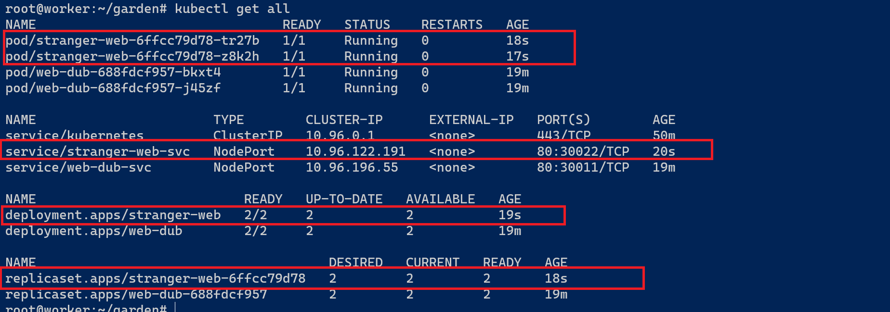

I will used `git pull` to get my local in sync.

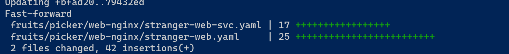

One handy tip to tell if we are sync with our Github is to make note of commit id and compare it together.


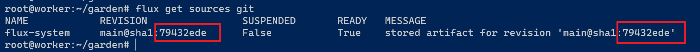  


### Deployment method: 3
#### Kustomization:
At the moment we have set one location for flux to watch out for  and that’s what we were using all along. What if we want to extend that to other repos, that's when Kusotmiztion come to rescue. 

I have another repository called `kustomize-me` consisting of two yamls files .
```
neighbour.yaml
```

```
apiVersion: apps/v1
kind: Deployment
metadata:
  creationTimestamp: null
  labels:
    app: neighbour-web
  name: neighbour-web
  namespace: default
spec:
  replicas: 2
  selector:
    matchLabels:
      app: neighbour-web
  strategy: {}
  template:
    metadata:
      creationTimestamp: null
      labels:
        app: neighbour-web
    spec:
      containers:
      - image: nginx
        name: nginx


```
```
neighbours-svc.yaml
```

```
apiVersion: v1
kind: Service
metadata:
  creationTimestamp: null
  labels:
    app: neighbour-web
  name: neighbour-web-svc
  namespace: default
spec:
  ports:
  - port: 80
    protocol: TCP
    targetPort: 80
    nodePort: 30022
  selector:
    app: neighbour-web
  type: NodePort
```
###### Source & Kustomization

With the help of  flux create command, I will create one source yaml file  `main-neighbour-source.yaml`  and place it in `fruits/picker/`, in the same location one Kustomization in form of  `main-neighbour-kustomize.yaml` file. 

By doing so flux will be able to extend it’s reach to my next repo so I don’t have to worry about just one location from now on.

```
flux create source git main-neighbour-source  --url https://github.com/ikmildil/kustomize-me  --branch main  --timeout 20s  --export > fruits/picker/main-neighbour-source.yaml
```
```
flux create kustomization main-neighbour-kustomize  --source GitRepository/main-neighbour-source  --prune true  --interval 20s  --target-namespace neighbour  --export > fruits/picker/main-neighbour-kustomize.yaml
```

Now if we look at our `kubectl` command output again. We can see that  we have another deployment `neighbour-web` and service `neighbour-web-svc` all up and running. _Isn't that magical._

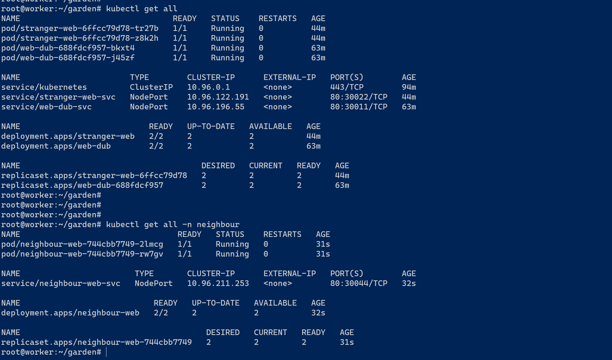

##### Some Error:

while copying and pasting yaml contents I forgot to change the Port number and I had one error showing up. Error was about Port already being in used by other deployement. It was easy fix but i thought let me add that to the article.

  


